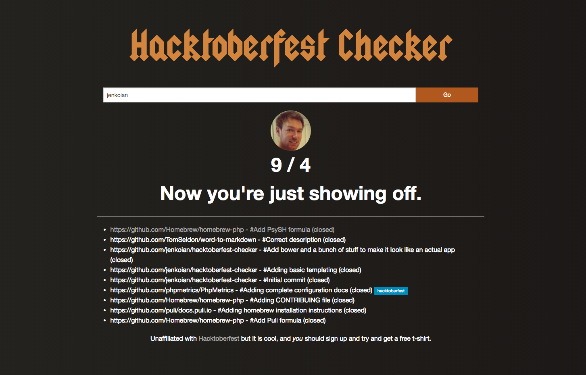

# Hacktoberfest Checker

Useful checker web app for seeing how close you are to achieving the requirements for a free t-shirt as part of [Hacktoberfest](https://hacktoberfest.digitalocean.com/).

[https://hacktoberfestchecker.herokuapp.com/](https://hacktoberfestchecker.herokuapp.com/)

**Updated for 2016**

* Updated design
* Hacktoberfest label support

Get involved by picking up some of the issues labelled [hacktoberfest](https://github.com/jenkoian/hacktoberfest-checker/issues?q=is%3Aopen+is%3Aissue+label%3Ahacktoberfest) to help toward your tally.

## Running the app

* [Generate a GitHub personal access token](https://github.com/settings/tokens) to ensure you don't get rate limited easily.

* Export the GitHub token as an environment variable for Node.js to use.
    * Mac/Linux: `export GITHUB_TOKEN=YOUR_TOKEN`
    * Windows (cmd.exe): `set GITHUB_TOKEN=YOUR TOKEN`
    * Windows (Powershell): `$env:GITHUB_TOKEN=YOUR TOKEN`

* `npm install`

* `node index.js`

* Point browser to [localhost:5000](http://localhost:5000)

## TODO (2015)

- [x] Ajax form submission
- [x] Fix ability to link to users that ajax fix above broke (e.g. http://localhost:5000/?username=jenkoian)
- [x] Implement an actual web page using Bootstrap or something
- [x] Add field for entering GitHub username
- [x] Cache usernames and etags to make use of `If-None-Match` to reduce risk of reaching rate limit on github API.
- [x] Show a list of pull requests in question
- [x] Add disclaimer (GitHub API only allows max of 300 events, so if you're a busy github bee, it probably won't do you justice)
- [x] *or* even better than the above disclaimer, use the search API rather than the event API
- [x] Add contextual message, e.g. 2/4 PRs done "Half way there", 4/4 PRs done "Way to go", 12/4 PRs done "Now you're showing off"

## License

MIT (c) 2015-2016 [Ian Jenkins](https://github.com/jenkoian)
