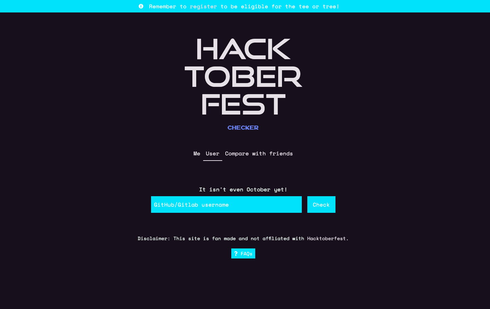

# Hacktoberfest Checker

[](https://github.com/jenkoian/hacktoberfest-checker/actions?query=workflow%3ABuild)


Useful checker web app to see how close you are to achieving the requirements for a free t-shirt as part of [Hacktoberfest](https://hacktoberfest.com/).

[https://hacktoberfestchecker.jenko.me/](https://hacktoberfestchecker.jenko.me/)



## 2022!

Well I've had next to no time to do anything really other than a very light (and probably broken) re-skin.
As far as I'm aware nothing has changed in terms of rules this year, so only a re-skin that was required (if there are new rules, feel free to submit a PR - it'll count towards your total!)

### Doesn't DigitalOcean have their progress checker now?

They do! However, I still think it's worth having a checker that doesn't require auth and allows you to check on your mates (or celebrity developers!).

Happy hacking!

## Requirements

- Node LTS (v10/12/14)
  > Recommended to use [NVM](https://github.com/creationix/nvm)

## Running the app

- [Generate a GitHub personal access token](https://github.com/settings/tokens/new?scopes=&description=Hacktoberfest%20Checker) to ensure you don't get rate limited as often.

- [Generate a Gitlab personal access token](https://gitlab.com/-/profile/personal_access_tokens?scopes=api&name=Hacktoberfest%20Checker) to ensure gitlab is supported.

- Create a `.env` file using `.env.example` as an example. Or export the GitHub/Gitlab token as an environment variable for Node.js to use:

  - Mac/Linux: `export GITHUB_TOKEN=YOUR_TOKEN; export GITLAB_TOKEN=YOUR_TOKEN`
  - Windows (cmd.exe): `set GITHUB_TOKEN=YOUR_TOKEN; set GITLAB_TOKEN=YOUR_TOKEN`
  - Windows (PowerShell): `$env: GITHUB_TOKEN=YOUR_TOKEN; GITLAB_TOKEN=YOUR_TOKEN`

- `$ npm install`

- `$ npm run tailwind-gen`

- `$ npm start`

- Point browser to [localhost:5000](http://localhost:5000)

Want to run the API server and the frontend in their processes? Use this:

```bash
$ npm run start-frontend
$ npm run start-server
```

or in a single command...

```bash
$ npm run start-development
```

### Running the app within Docker

As an alternative to the section above, you can run the app within a Docker container:

- `$ docker build -t hacktoberfest-checker .`

- `$ docker run -p 5000:5000 -e "GITHUB_TOKEN=YOUR_TOKEN" hacktoberfest-checker`

or use the docker-compose

- `$ docker-compose up --build`

## Contributing

Check out the [Contributing guidelines](https://github.com/jenkoian/hacktoberfest-checker/blob/master/CONTRIBUTING.md) to get started on contributing.

## Changing styling

Styling is done through [tailwind](https://tailwindcss.com/) as much as possible, no CSS should be added and class names favoured.
However, there will be occasions where custom CSS is required, in this case you need to edit `style.css`
and run `npm run tailwind-gen` to generate the new CSS file.

> Note: You should never directly edit `index.css`

## License

MIT © 2015-2021 [Ian Jenkins](https://github.com/jenkoian)
