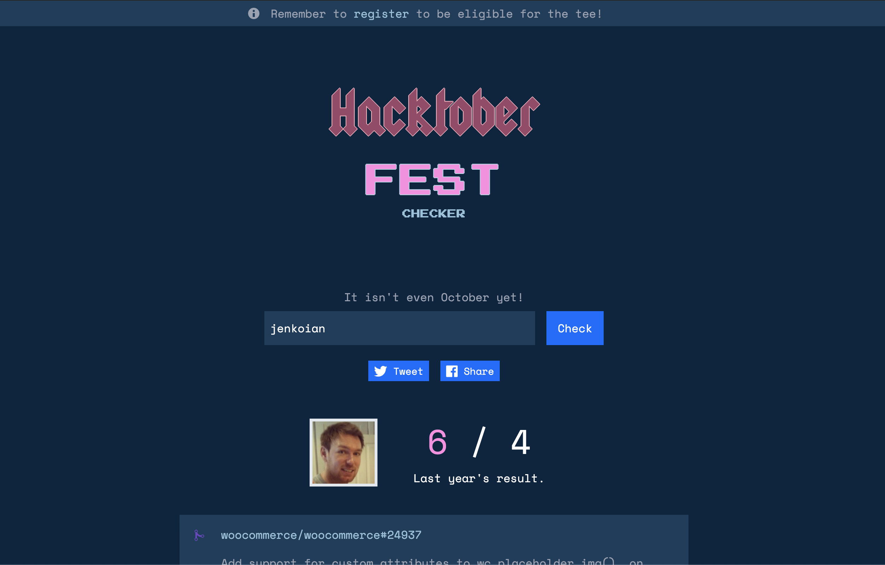

# Hacktoberfest Checker

[](https://travis-ci.org/jenkoian/hacktoberfest-checker)


Useful checker web app to see how close you are to achieving the requirements for a free t-shirt as part of [Hacktoberfest](https://hacktoberfest.digitalocean.com/).

[https://hacktoberfestchecker.jenko.me/](https://hacktoberfestchecker.jenko.me/)



## 2020!

Been really short on time this year, so just a quick reskin rather than any major tech advancements.

I will add some issues when I get chance of ideas that can be contributed, I'll continue to do this throughout the month.

Finally, I have to give a big shout out to [DigitalOcean](https://www.digitalocean.com/) and [Dev](https://dev.to/) for yet another awesome event and their support for this checker app.

### Doesn't DigitalOcean have their progress checker now?

They do! However, I still think it's worth having a checker that doesn't require auth and allows you to check on your mates (or celebrity developers!).

Happy hacking!

## Requirements

* Node v10+
> Recommended to use [NVM](https://github.com/creationix/nvm)

## Running the app

* [Generate a GitHub personal access token](https://github.com/settings/tokens/new?scopes=&description=Hacktoberfest%20Checker) to ensure you don't get rate limited as often.

* Create a `.env` file using `.env.example` as an example. Or export the GitHub token as an environment variable for Node.js to use:
   * Mac/Linux: `export GITHUB_TOKEN=YOUR_TOKEN`
   * Windows (cmd.exe): `set GITHUB_TOKEN=YOUR TOKEN`
   * Windows (PowerShell): `$env: GITHUB_TOKEN=YOUR TOKEN`

* `$ npm install`

* `$ npm run tailwind-gen`

* `$ npm start`

* Point browser to [localhost:5000](http://localhost:5000)

Want to run the API server and the frontend in their processes? Use this:
```bash
$ npm run start-frontend
$ npm run start-server
```

or in a single command...

```bash
$ npm run start-development
```

### Running the app within Docker

As an alternative to the section above, you can run the app within a Docker container:

* `$ docker build -t hacktoberfest-checker .`

* `$ docker run -p 5000:5000 -e "GITHUB_TOKEN=YOUR_TOKEN" hacktoberfest-checker`

or use the docker-compose

* `$ docker-compose up --build`

## Changing styling

Styling is done through [tailwind](https://tailwindcss.com/) as much as possible no CSS should be added and class names favoured.
However, there will be occasions where custom CSS is required, in this case you need to edit `style.css`
and run `npm run tailwind-gen` to generate the new CSS file.

> Note: You should never directly edit `index.css`

## License

MIT © 2015-2020 [Ian Jenkins](https://github.com/jenkoian)
