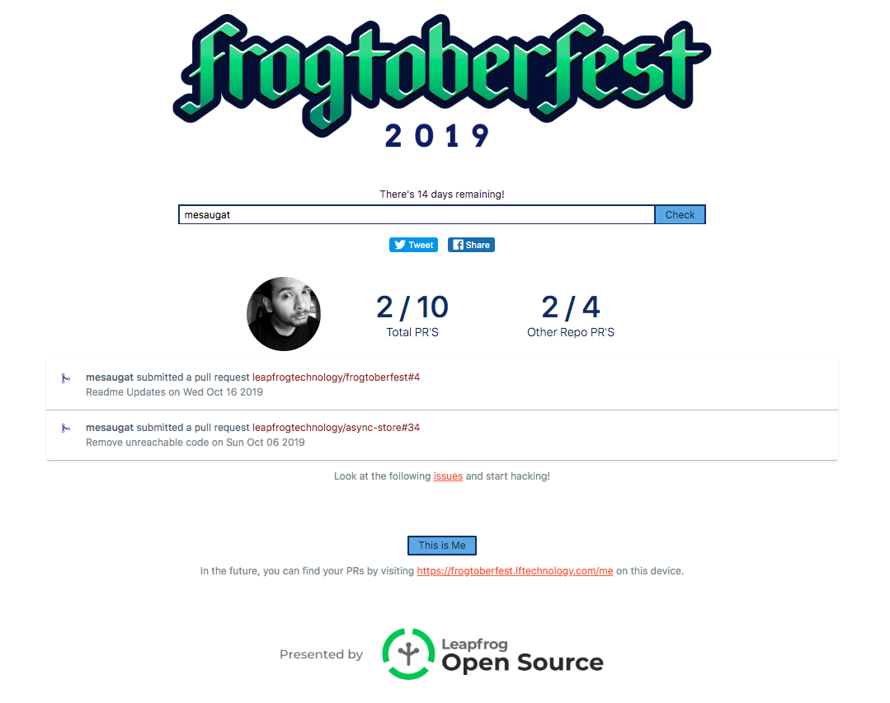

# Frogtoberfest Checker

[](https://circleci.com/gh/leapfrogtechnology/frogtoberfest/tree/master)

Web app to track your progress for Frogtoberfest.

Happy Hacking!

[https://frogtoberfest.lftechnology.com/](https://frogtoberfest.lftechnology.com/)
([https://frogtoberfest.lftechnology.com/](https://frogtoberfest.lftechnology.com/))



## Requirements

* Node v8+

> Recommended to use [NVM](https://github.com/creationix/nvm)

## Running the app

* [Generate a GitHub personal access token](https://github.com/settings/tokens/new?scopes=&description=Hacktoberfest%20Checker) to ensure you don't get rate limited as often.

* Create a `.env` file using `.env.example`. Or export your GitHub token as `GITHUB_TOKEN` environment variable in your system:
   * Mac/Linux: `export GITHUB_TOKEN=YOUR_TOKEN`
   * Windows (cmd.exe): `set GITHUB_TOKEN=YOUR TOKEN`
   * Windows (PowerShell): `$env:GITHUB_TOKEN=YOUR TOKEN`

* Install dependencies and run it.
  ```bash
  $ yarn
  $ yarn start
  ```

* Open [http://localhost:5000](http://localhost:5000)

Want to run the API server and the frontend in their own processes? Use this:
```bash
$ yarn start-frontend
$ yarn start-server
```

### Running the app within Docker

As an alternative to the section above, you can run the app within a Docker container:

```bash
$ docker build -t hacktoberfest-checker .
$ docker run -p 5000:5000 -e "GITHUB_TOKEN=YOUR_TOKEN" hacktoberfest-checker
```

Alternatively, you can use docker-compose.

```bash
$ docker-compose up --build
```

## License

MIT © 2015-2018 [Ian Jenkins](https://github.com/jenkoian)
