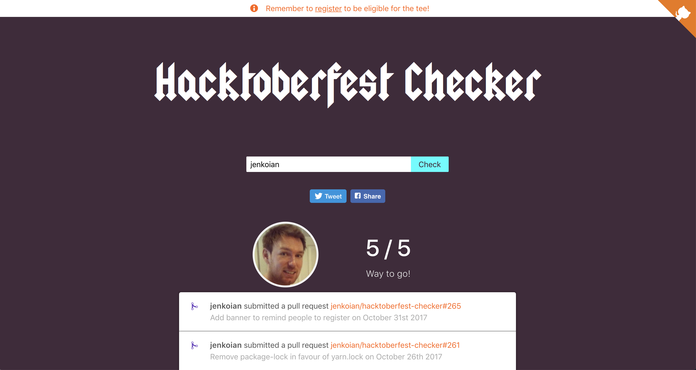

# Hacktoberfest Checker

Useful checker web app to see how close you are to achieving the requirements for a free t-shirt as part of [Hacktoberfest](https://hacktoberfest.digitalocean.com/).

[https://hacktoberfestchecker.jenko.me/](https://hacktoberfestchecker.jenko.me/)
([https://hacktoberfestchecker.herokuapp.com/](https://hacktoberfestchecker.herokuapp.com/) will still work)

## 2018!

I had some grand plans for this years edition but unfortunately I've not had the time. It basically equates to using
React on the front end. I did make a start, and may look to release it midway through Hacktoberfest. If you fancy hacking
along with me, keep an eye on the react branch. Other than that, I've done a simple reskin and more or less
kept it as it were last year (obviously updated the year and new PR requirement).

I will add some tickets when I think of them of improvements etc. feel free to suggest any you can think of though too.

You may notice the domain has changed, the old heroku app is still up and I will deploy to both, but the new domain is hosted on 
digital ocean as they were kind enough to offer me some hosting vouchers. 

Happy hacking!

## Requirements

* Node v8+
> Recommended to use [NVM](https://github.com/creationix/nvm)

## Running the app

* [Generate a GitHub personal access token](https://github.com/settings/tokens/new?scopes=&description=Hacktoberfest%20Checker) to ensure you don't get rate limited as often.

* Create a `.env` file using `.env.example` as an example. Or export the GitHub token as an environment variable for Node.js to use:
   * Mac/Linux: `export GITHUB_TOKEN=YOUR_TOKEN`
   * Windows (cmd.exe): `set GITHUB_TOKEN=YOUR TOKEN`
   * Windows (PowerShell): `$env:GITHUB_TOKEN=YOUR TOKEN`

* `$ yarn install`

* `$ yarn start`

* Point browser to [localhost:5000](http://localhost:5000)

### Running the app within Docker

As an alternative to the section above, you can run the app within a Docker container:

* `$ docker build -t hacktoberfest-checker .`

* `$ docker run -p 5000:5000 -e "GITHUB_TOKEN=YOUR_TOKEN" hacktoberfest-checker`

or use the docker-compose

* `$ docker-compose up --build`

## License

MIT © 2015-2018 [Ian Jenkins](https://github.com/jenkoian)
