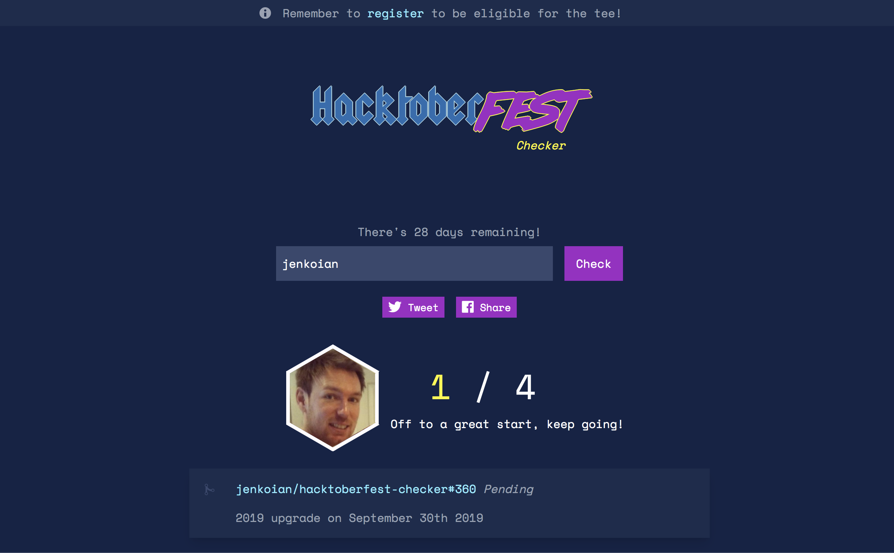

# Hacktoberfest Checker

[](https://travis-ci.org/jenkoian/hacktoberfest-checker)


Useful checker web app to see how close you are to achieving the requirements for a free t-shirt as part of [Hacktoberfest](https://hacktoberfest.digitalocean.com/).

[https://hacktoberfestchecker.jenko.me/](https://hacktoberfestchecker.jenko.me/)



## 2019!

My plan for this year's edition was to use next.js but sadly I ran out of time (starting the night before October may not have been the best plan!). 
If anyone fancies learning [next.js](https://nextjs.org) along with me take a look at the [nextjs](https://github.com/jenkoian/hacktoberfest-checker/tree/nextjs) branch where I start from scratch or the [nextjs2](https://github.com/jenkoian/hacktoberfest-checker/tree/nextjs2) branch where I convert the existing app to nextjs.
In case you hadn't worked it out already, JS is not my area of expertise, but one of the things I use this repo for is to keep up with JS and various libraries and things I read about and nextjs is something I like the look of.

So whether the nextjs version sees the light of day or not, I've still made a few updates to the existing app for 2019:

* Updated the logo and color scheme to fit the new theme
* Used a hexagon for the user image
* Updated a few underlying libraries

I'll try and get some issues up which I think might be good things to contribute. 

I've removed the issue and pull request templates as I find them more of a barrier than anything. That said, I'm not opposed to reviewing new versions should anyone wish to PR.

Finally, I have to give a big shout out to [DigitalOcean](https://www.digitalocean.com/) and [Dev](https://dev.to/) for yet another awesome event and their support for this checker app also.

### Doesn't DigitalOcean have their progress checker now?

They do! However, I still think it's worth having a checker that doesn't require auth and allows you to check on your mates (or celebrity developers!).

Happy hacking!

## Requirements

* Node v10+
> Recommended to use [NVM](https://github.com/creationix/nvm)

## Running the app

* [Generate a GitHub personal access token](https://github.com/settings/tokens/new?scopes=&description=Hacktoberfest%20Checker) to ensure you don't get rate limited as often.

* Create a `.env` file using `.env.example` as an example. Or export the GitHub token as an environment variable for Node.js to use:
   * Mac/Linux: `export GITHUB_TOKEN=YOUR_TOKEN`
   * Windows (cmd.exe): `set GITHUB_TOKEN=YOUR TOKEN`
   * Windows (PowerShell): `$env: GITHUB_TOKEN=YOUR TOKEN`

* `$ npm install`

* `$ npm run tailwind-gen`

* `$ npm start`

* Point browser to [localhost:5000](http://localhost:5000)

Want to run the API server and the frontend in their processes? Use this:
```bash
$ npm run start-frontend
$ npm run start-server
```

or in a single command...

```bash
$ npm run start-development
```

### Running the app within Docker

As an alternative to the section above, you can run the app within a Docker container:

* `$ docker build -t hacktoberfest-checker .`

* `$ docker run -p 5000:5000 -e "GITHUB_TOKEN=YOUR_TOKEN" hacktoberfest-checker`

or use the docker-compose

* `$ docker-compose up --build`

### Frequently Asked Questions
**1.  Why do some PRs have 'Pending' next to them?**
There is a grace period this year which means that a PR must be open (or merged) for at least a week in order to give maintainers the chance to mark issues as invalid. Therefore, the PR will be marked as 'Pending' until that grace period has expired.

**2. Why do some PRs show outside of October?**
If you've submitted a PR on the last day of September or the first day of November, there is a chance of it counting if it is October in any timezone.

## License

MIT © 2015-2019 [Ian Jenkins](https://github.com/jenkoian)
