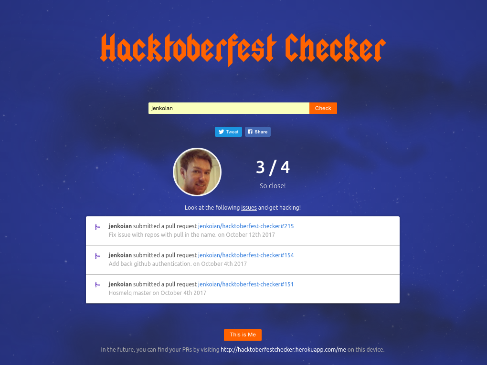

# Hacktoberfest Checker

Useful checker web app to see how close you are to achieving the requirements for a free t-shirt as part of [Hacktoberfest](https://hacktoberfest.digitalocean.com/).

[https://hacktoberfestchecker.herokuapp.com/](https://hacktoberfestchecker.herokuapp.com/)

## 2017!

I've stripped the app right back this year with a small lick of paint to match the new colour scheme.
I really like the idea of it being a basic project that beginners can contribute to so wanted to keep it simple.

I have added [some tickets](https://github.com/jenkoian/hacktoberfest-checker/issues?q=is%3Aissue+is%3Aopen+label%3Ahacktoberfest)
so please take a look if you'd like to contribute or feel free to propose any ideas you may have.

Happy hacking!

## Running the app

* [Generate a GitHub personal access token](https://github.com/settings/tokens/new?scopes=&description=Hacktoberfest) to ensure you don't get rate limited as often.

* Create a `.env` file using `.env.example` as an example. Or export the GitHub token as an environment variable for Node.js to use:
   * Mac/Linux: `export GITHUB_TOKEN=YOUR_TOKEN`
   * Windows (cmd.exe): `set GITHUB_TOKEN=YOUR TOKEN`
   * Windows (PowerShell): `$env:GITHUB_TOKEN=YOUR TOKEN`

* `$ npm install`

* `$ npm start`

* Point browser to [localhost:5000](http://localhost:5000)

### Running the app within Docker

As an alternative to the section above, you can run the app within a Docker container:

* `$ docker build -t hacktoberfest-checker .`

* `$ docker run -p 5000:5000 -e "GITHUB_TOKEN=YOUR_TOKEN" hacktoberfest-checker`

## License

MIT © 2015-2017 [Ian Jenkins](https://github.com/jenkoian)
